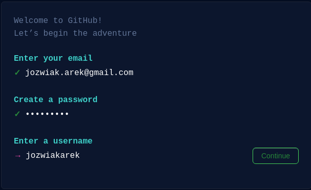
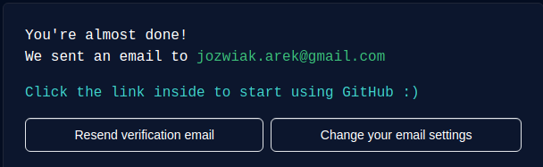
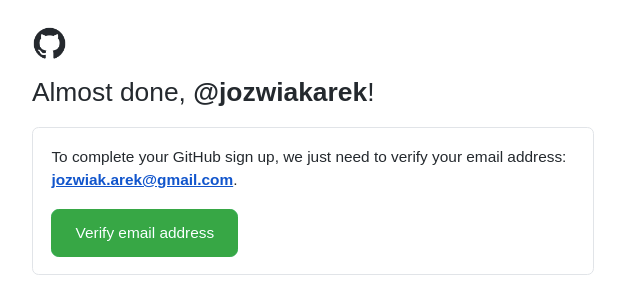

Co to jest system kontroli wersji

Systemy kontroli wersji (ang. VCS – version control system) – jest to oprogramowanie, 
które wspiera programistów podczas pracy nad projektem programistycznym.

Pozwala ono m.in. na sprawdzanie zmian, jakie zostały wykonane, cofanie modyfikacji.
Dzięki niemu wiemy, kto i kiedy daną zmianę wprowadził. 
Modyfikacje mogą zawierać dodatkowe opisy tak, by cel określonych zmian był łatwiejszy do interpretacji.

Wyobraź sobie, że chcesz przechowywać różne wersje swojego oprogramowania, 
naturalnym sposobem byłoby tworzenie kopii w oddzielnych katalogach. 
Dodatkowo, by mieć większą kontrolę nad wersjami w nazwie dodamy oraz krótki opis. 
Jeżeli chcielibyśmy rozszerzać informacje o wprowadzanych zmianach możliwe,
 że dodatkowo utworzymy plik tekstowy lub excel z dodatkowym opisem.

Takie rozwiązanie nie jest niestety pozbawione wad, z każdą wersją zwiększa się rozmiar 
naszego archiwum. Łatwo przy takim podejściu o pomyłkę np. wprowadzić zmiany w złym katalogu. 
Trudnym jest cofanie pojedynczych zmian w plikach. 

Sprawa jeszcze bardziej się komplikuje, gdy nad projektem pracuje więcej niż jedna osoba.
W jaki sposób przechowywać kopie każdego z pracujących przy projekcie programistów.
Jak łączyć wykonaną przez nich pracę do jednego projektu.

Rozwiązaniem powyższych problemów są systemy kontroli wersji, 
które pozwalają w łatwy sposób zapisywać poszczególne wersje. 
Mamy możliwość przeglądania historii zmian, sprawdzać kto i kiedy jaką modyfikację wykonał.

Programiści, tworząc aplikację, dokonują ciągłych zmian w jej kodzie, publikują nowe jej wersje.
Dzięki dodatkowym mechanizmom możemy łączyć zmiany wykonywane przez wielu programistów.

Na kursie zapoznamy się z systemem kontroli wersji git, który udostępniany jest m.in. przez portal github.com.
GitHub jest serwisem internetowym przeznaczonym dla projektów programistycznych, które wykorzystują system kontroli wersji git.

Umożliwia on tworzenie repozytoriów z kodem, czyli w praktyce, katalogów z projektem.
W ramach serwisu github.com możemy tworzyć repozytoria publiczne — ich zawartość jest dostępna publicznie.
Innym typem są repozytoria prywatne — te wymagają praw dostępu, które samodzielnie definiujemy.

Git nie jest jedynym systemem tego typu, ale na pewno najpopularniejszym. 

Istnieją również alternatywne dla github.com serwisy np. bitbucket.com czy gitlab.com.
 
Ponownie github.com jest najpopularniejszym z nich.

Podczas kursu, w serwisie GitHub będą Ci udostępniane zadania oraz egzaminy. 
Pierwszą styczność z serwisem będziesz mieć już podczas wykonywania zadań przygotowujących, czyli preworku.

W rzeczywistych projektach programistycznych serwis GitHub jest wykorzystywany jako miejsce przechowywania źródła kodu.

Zaczniemy od utworzenia konta w serwisie GitHub, w tym celu odwiedzamy stronę github.com.
Z prawego górnego rogu wybieramy opcję Sign up. 

W następnym kroku podajemy adres email, hasło oraz nazwę użytkownika:

Ostatnim krokiem będzie potwierdzenie adresu email, poprzez kliknięcie linku z wiadomości.

Poniżej przykład takiej wiadomości:

