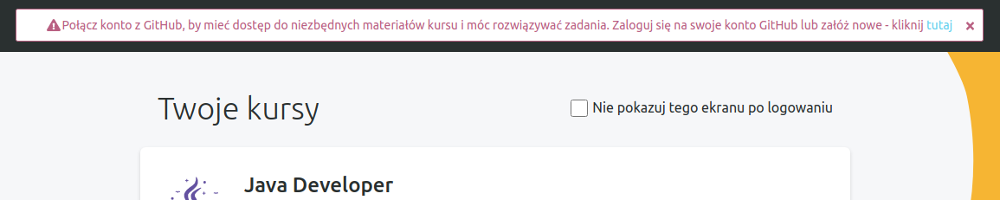
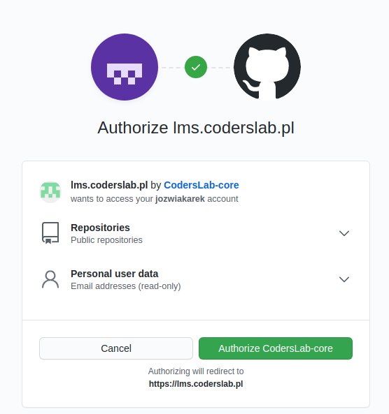
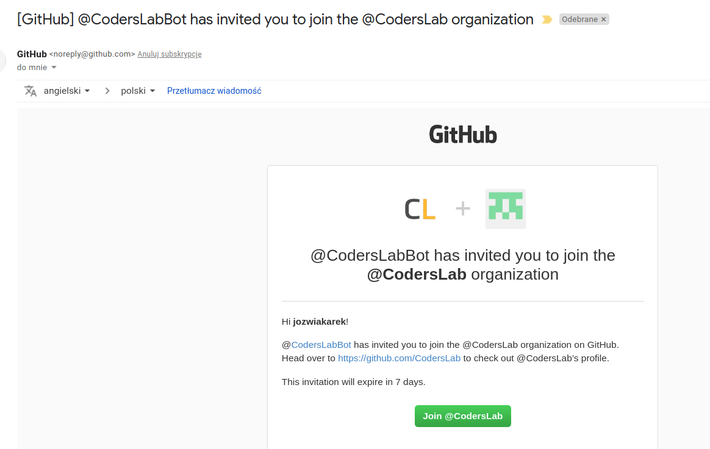
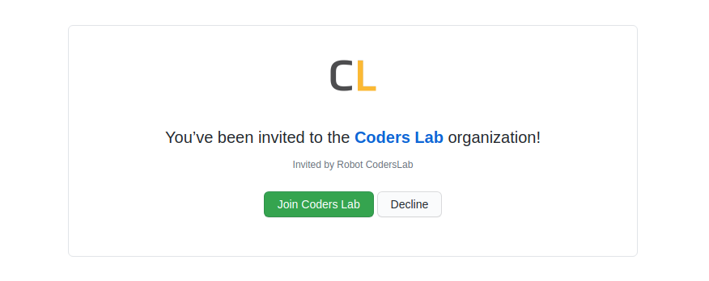
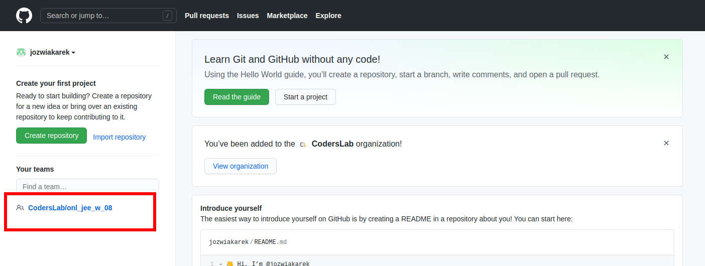
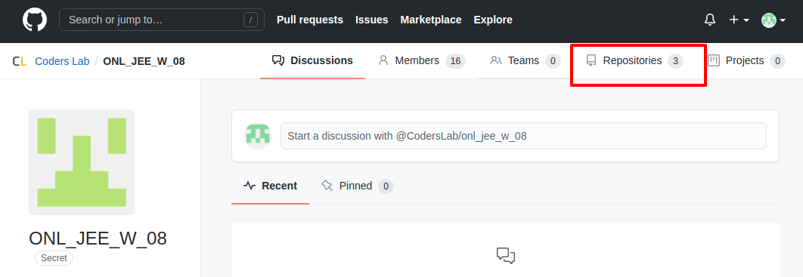
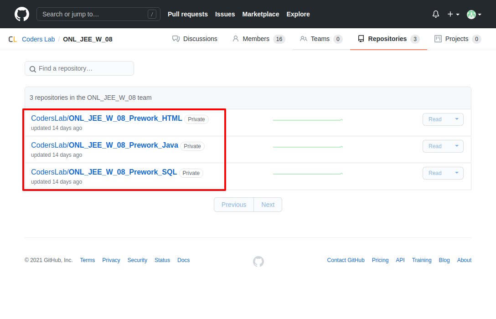

### Połączenie konta z kontem na Github

Podczas pierwszego logowania do systemu lms otrzymasz poniższy komunikat:

Do zakończenia konfiguracji LMS konieczne jest autoryzacja dostępu do konta.
Po wybraniu wyżej wskazanego linku dostaniemy prośbę o autoryzację:

zatwierdzamy wybierając zielony przycisk.

W kolejnym kroku otrzymamy wiadomość email o zaproszeniu do organizacji CodersLab:

ponownie zatwierdzamy:

Przechodząc teraz do konta na github będziemy mieli dostęp do zespołu:

Po przejściu w link zespołu mamy dostęp do repozytorów, które dotyczą zadań z preworku:

Ilość oraz nazwy repozytoriów będą się różnić w zależności od rodzaju kursu oraz grupy.

