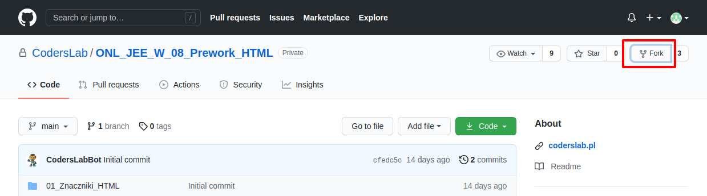
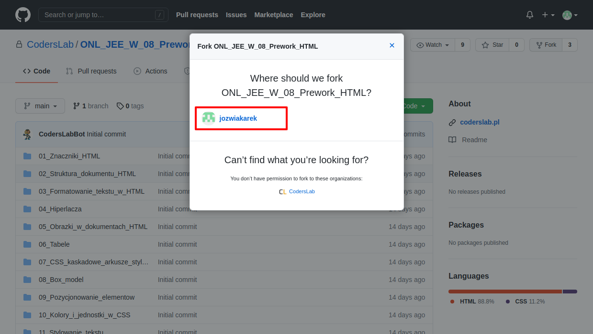
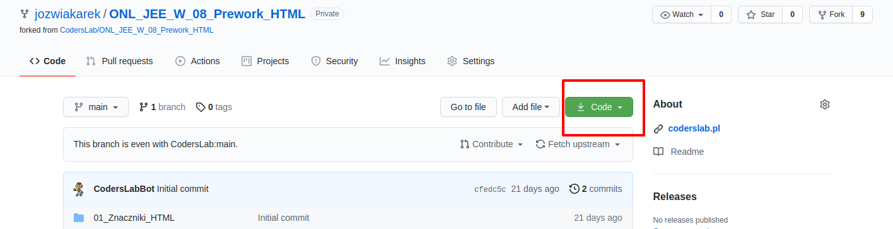
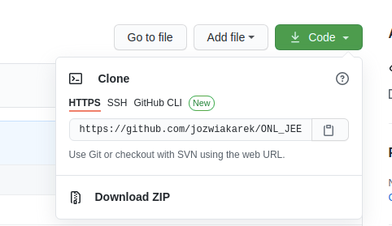

## Jak pobrać repozytorium na komputer

Zanim pobierzemy repozytorium lokalnie w pierwszej kolejności tworzymy **fork**.
W tym celu będąc na stronie repozytorium wybieramy opcję:



następnie wybieramy konto GitHub na jakie mamy dokonać forka.



Po zatwierdzeniu konta zostaniemy przekierowani do nowego repozytorium.
To na co należy zwrócić uwagę to zmiana adresu względem początkowego.

Początkowe repozytorium miało adres:
```https://github.com/CodersLab/ONL_JEE_W_08_Prework_HTML```

po wykonaniu forka prawidłowy będzie zawierał nazwę konta na github, np:

```https://github.com/jozwiakarek/ONL_JEE_W_08_Prework_HTML```

W pierwszym nazwa konta to **CodersLab** w drugim zawiera Twoją własną nazwę użytkownika.
W naszym przykładzie jest to **jozwiakarek**.

Z tak wykonanego forka możemy pobrać repozytorium bezpośrednio na nasz komputer.

W dalszej części artykułu znajdziesz więcej informacji czym jest fork.
 
### Weryfikacja instalacji git.

W ramach kursów Java oraz python udostępniany jest skrypt instalacyjny, 
który zawiera odpowiednie komendy instalujące oprogramowanie git.
Dla pewności zweryfikuj czy git jest poprawnie zainstalowany na Twoim komputerze.
W tym celu otwórz terminal, a następnie wpisz polecenie:
```bash
git --version
```
Jeżeli w odpowiedzi dostaniemy komunikat podobny do poniższego (mogą być różne oznaczenia numeryczne):
```bash
git version 2.25.1
```
oznacza to, że mamy poprawnie zainstalowanego gita na komputerze.
W przeciwnym wypadku wykonaj instrukcję instalacji:
[https://git-scm.com/book/en/v2/Getting-Started-Installing-Git](https://git-scm.com/book/en/v2/Getting-Started-Installing-Git)

### Pobieranie repozytorium lokalnie

Po weryfikacji poprawności instalacji gita w naszym systemie oraz utworzeniu forka 
przechodzimy do pobrania repozytorium bezpośrednio na nasz komputer.
W tym celu otwieramy terminal, następnie wpisujemy polecenie:


Najczęściej używaną opcją jest sklonowanie danego repozytorium.

1. Wchodzisz na adres swojego repozytorium, a następnie klikasz na zielony przycisk po prawej stronie:



2. Otworzy się okienko, z którego kopiujesz adres do schowka.
 


Poszczególne opcje omówimy w późniejszych artykułach na temat GitHub.

3. Przechodzisz do terminala na swoim komputerze, a w nim przechodzisz do katalogu, w którym przechowujesz swoje projekty.

Wpisujesz w terminalu polecenie:

```
git clone https://github.com/nasz-uzytkownik/nasz-projekt.git
```
zastępując **https://github.com/nasz-uzytkownik/nasz-projekt.git** skopiowanym adresem.

Git powinien utworzyć nowy katalog z tym projektem wraz ze sklonowaną do niego zawartością.

Katalog taki będzie miał nazwę projektu, którą podałeś przy zakładaniu repozytorium. Nazwę tego katalogu możesz w razie czego ręcznie zmienić lub, jeżeli ci nie odpowiada, podać nową przy klonowaniu:

```
git clone https://github.com/nasz-uzytkownik/nasz-projekt.git nowa_nazwa_katalogu
```


### Czym jest fork

Fork — jest kopią repozytorium, którą możemy samodzielnie utworzyć zgodnie z powyższym opisem.
Tworzymy tym sposobem własną niezależną wersję innego repozytorium, którym możemy dowolnie zarządzać.
Najczęściej są wykorzystywane, gdy chcemy wykorzystać jakiś projekt jako punkt startowy dla własnego.
Dzięki nim możemy również zaproponować wprowadzenie jakiejś zmiany do innego projektu.


Więcej na temat forków dowiemy się tutaj:
[https://docs.github.com/en/github/getting-started-with-github/quickstart/fork-a-repo](https://docs.github.com/en/github/getting-started-with-github/quickstart/fork-a-repo)
[https://guides.github.com/activities/forking/](https://guides.github.com/activities/forking/)
